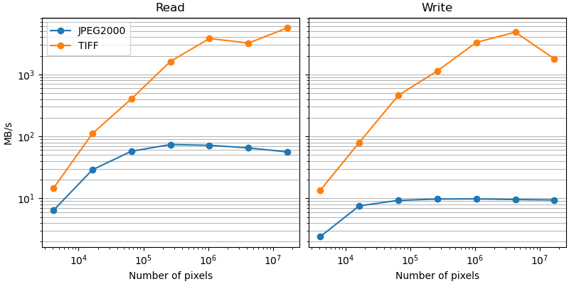

# Data speed tests

This repository contains some very basic/rough/scruffy scripts for doing back-of-the-envelope benchmarking for various data operations we use in the HiP-CT project.

Contributions welcome if you'd like to see something else on one of the graphs, or a similar graph. Please open an issue with the request instead of a PR, so we can keep the results consistent.

## Results
All rates are given in data/time, so larger is better on the y-axis.

Configuration:
- JPEG2000 files are written with a compression ratio of 10.

### Reading/writing different data formats

Used `glymur` for JPEG2000s and `tifffile` for TIFFs.

### Reading/writing JPEG2000 files

